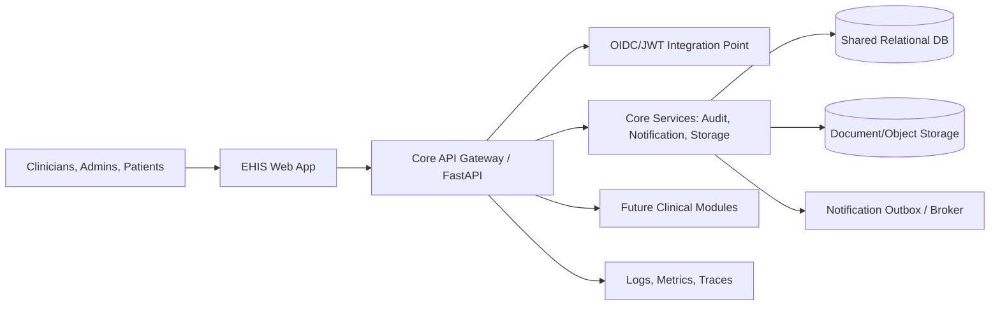
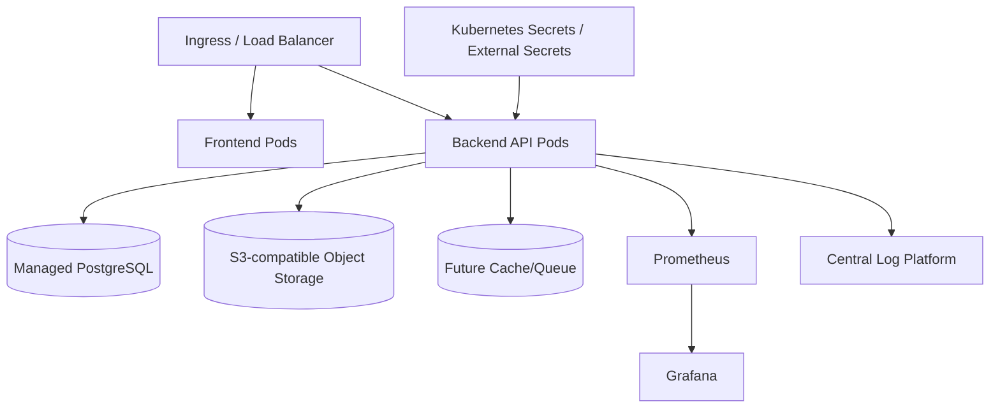

# Architecture

## Executive summary
EHIS Module 01 establishes a modular, API-first foundation for multi-branch hospital operations. The platform separates clinical/business modules from cross-cutting infrastructure: configuration, auditability, observability, security seams, document storage, notifications, and reusable UI components. It is designed for cardiovascular and oncology workflows that require high availability, traceability, branch-aware data partitioning, regulated data handling, and integration with future identity, EMR, LIS, RIS/PACS, billing, and patient engagement services.

## System architecture diagrams

### Logical architecture

### Physical architecture

