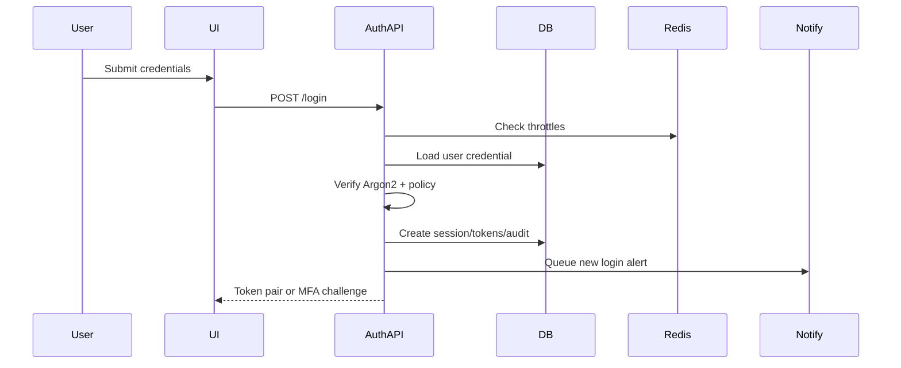
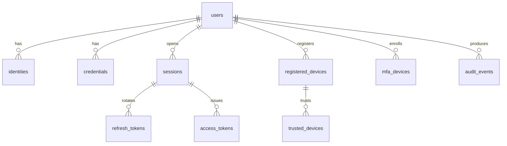

# Module 02: Authentication & Identity Management

## Part 1 — Business Analysis

### Scope
Module 02 centralizes identity proofing, credential verification, session issuance, token lifecycle management, device trust, account recovery, MFA, SSO, API authentication, and emergency break-glass authentication for all EHIS users and integrations. Authorization, job roles, clinical privileges, and permissions are intentionally excluded and delegated to Module 03.

### Objectives
- Authenticate workforce, patient, partner, vendor, mobile, kiosk, desktop, API, and service identities across hospitals and clinics.
- Provide OAuth2, OpenID Connect, JWT, refresh token rotation, PKCE, MFA, passwordless, SSO, and future AD/LDAP federation.
- Maintain immutable auditability for security-relevant events.
- Scale beyond 10,000 users with Redis-backed throttling, PostgreSQL transactional persistence, Celery notifications, and horizontally scalable stateless APIs.

### Assumptions
- PostgreSQL is the system of record; Redis stores ephemeral challenges, rate-limit counters, captcha state, and token deny-list entries.
- Secrets are stored in a KMS or vault; database rows hold references and hashes only.
- TLS is terminated at the ingress and enforced end-to-end for service-to-service traffic.
- Module 03 consumes identity claims and scopes but owns role and permission decisions.

### Constraints
- No plaintext passwords, MFA secrets, private keys, recovery codes, or API keys may be persisted.
- Patient authentication must support lower-friction recovery while maintaining strong proofing for clinical data access.
- Kiosk authentication must enforce short sessions and staff re-authentication for protected functions.
- Offline desktop and mobile modes may cache only short-lived, encrypted authentication artifacts.

### Risks
- Credential stuffing and password spraying against public portals.
- Compromised refresh tokens on shared clinical workstations.
- Federation metadata drift or IdP outage.
- Break-glass misuse during emergencies.
- SIM-swap attacks against SMS MFA and recovery.

### Dependencies
- Module 01 observability, configuration, messaging, database, cache, and deployment foundations.
- Notification providers for email, SMS, push, authenticator enrollment, and future WhatsApp.
- KMS/vault, HSM-backed signing keys, ingress/WAF, IP reputation, and geo-location services.

## Part 2 — Authentication Workflows

1. **Standard Login**: collect username/password, normalize identifier, apply IP and username throttles, verify Argon2 hash, evaluate account status, require MFA when policy demands, create session, issue JWT access token and rotating refresh token, audit outcome, notify on new or suspicious login.
2. **Single Sign-On**: redirect to configured OIDC/SAML IdP, enforce state and nonce, validate signed assertion, map issuer and subject to identity, create or link user after verification policy, require local MFA if assurance is insufficient, issue local EHIS tokens.
3. **Password Reset**: validate reset token, verify proofing factors, enforce password policy and history, revoke existing password credentials, invalidate active sessions when policy requires, notify user.
4. **Forgot Password**: accept username/email/phone, return neutral response, rate limit requests, send expiring recovery link or OTP to verified channel, record recovery request.
5. **First Time Login**: verify invitation or temporary credential, force password setup, enroll MFA, verify email/phone, accept security notices, issue tokens only after required enrollment.
6. **Password Expiration**: detect expired password credential during login, issue password-change challenge, allow change after current password plus MFA, deny normal session until complete.
7. **Account Lockout**: count failed attempts in rolling windows by user, IP, device, and facility; lock account after threshold; notify user and security; unlock automatically or by verified recovery/admin action.
8. **MFA Enrollment**: authenticate primary factor, generate TOTP/WebAuthn/SMS/push enrollment challenge, confirm code or attestation, store secret reference or public key, generate recovery codes, audit.
9. **MFA Verification**: validate challenge binding, verify code or signature, enforce replay protection, update assurance level to AAL2/AAL3, optionally trust device.
10. **Session Timeout**: expire access token after 15 minutes, idle session after policy window, absolute session after 12 hours for workforce and 30 days for patient remember-me refresh families.
11. **Remember Device**: after successful MFA, create trusted-device token hash scoped to user, device, and risk posture; bypass MFA only until trust expiry and only for low-risk logins.
12. **Device Registration**: capture device name, platform, push token reference, and privacy-preserving fingerprint hash; enforce maximum devices; notify on registration.
13. **Device Revocation**: mark device and trust records revoked, deny future trust, revoke sessions from that device, audit.
14. **Emergency Break Glass Login**: require dedicated emergency credential, MFA where possible, reason, patient/context when known, short session, elevated audit severity, real-time security notification, mandatory post-event review.
15. **API Authentication**: accept OAuth2 client credentials, mTLS certificates, or hashed API keys; validate scopes, expiry, IP allowlists, and rotation status; issue scoped JWT or permit signed request.
16. **Patient Portal Login**: support password, passkey, OTP, and recovery; risk-score new devices and unusual geographies; protect clinical data with step-up MFA.
17. **Doctor Portal Login**: require MFA, device posture, short idle timeout, and step-up for prescribing, oncology protocols, and cardiovascular critical functions.
18. **Mobile Authentication**: use OAuth2 authorization code with PKCE, app attestation when available, biometric unlock against locally encrypted refresh token, remote wipe via device revocation.
19. **Refresh Token**: hash lookup, validate family, expiry, and session, rotate on every use, revoke family on replay, emit new access and refresh pair.
20. **Logout**: revoke current session and refresh token family, add active access token JTI to deny-list until expiry.
21. **Global Logout**: revoke all sessions, refresh tokens, trusted devices optionally, notify user, require fresh authentication.

## Part 3 — Database Design

The Django implementation defines the core tables in `backend/auth_identity/models.py`. Additional logical tables below complete the production schema.

### Core implemented tables
- `users`: UUID identity root with username, display name, verified contact pointers, status, identity type, facility, lock/deprovision timestamps; unique username and email; indexes on status/type and facility/status.
- `identities`: external or local identity assertions with provider, subject, issuer, verification flags, last assertion; unique provider+subject.
- `credentials`: password, passkey, certificate, and API key material with secret hashes or public material, expiry, revocation, metadata.
- `password_history`: historical hashes, actor, and reason for password reuse prevention.
- `sessions`: authenticated session with user, device, IP, user agent, timestamps, expiry, revocation, and assurance level.
- `refresh_tokens`: hashed rotating refresh tokens with family, expiry, rotation, revocation, and replay detection.
- `access_tokens`: JWT JTI records with audience, scopes, expiry, and revocation for introspection and emergency denial.
- `login_attempts`: normalized username, optional user, success, reason, IP, user agent, correlation ID.
- `registered_devices`: device name, platform, fingerprint hash, push token reference, last seen, revocation.
- `trusted_devices`: trust token hash, trust expiry, revocation.
- `authentication_methods`: enabled methods per user with verification timestamp and priority.
- `mfa_devices`: TOTP/SMS/email/push/WebAuthn device metadata, secret reference or public key, confirmation and revocation.
- `recovery_codes`: one-time hashed recovery codes with usage timestamp.
- `oauth_clients`: OIDC/OAuth clients with hashed secret, redirect URIs, scopes, grants, PKCE requirement, active flag.
- `api_clients`: service/API identities with hashed key, scopes, expiry, last use, revocation.
- `identity_providers` and `sso_providers`: issuer metadata, protocol, JWKS/metadata URLs, configuration, enabled flag.
- `audit_events` and `security_events`: actor, event type, outcome, IP, subject, correlation ID, JSON payload.
- `verification_tokens`: email and phone verification token hashes with destination hash, expiry, consumption.

### Additional production tables
- `failed_logins`: materialized aggregate by username, user, IP, device, rolling window start/end, count, last reason; unique aggregate key per window.
- `security_questions`: user, question identifier, localized prompt, Argon2 answer hash, active flag, created/retired timestamps.
- `recovery_requests`: user, channel, destination hash, token hash, status, risk score, expires, consumed, IP, user agent.
- `remember_me_tokens`: user, device, token hash, issued, expires, revoked, last used, risk metadata.
- `email_verification` and `phone_verification`: user, destination hash, token hash/OTP hash, attempts, expiry, verified timestamp.
- `biometric_registration`: user, device, modality, platform attestation reference, created, revoked.
- `biometric_templates`: biometric registration, encrypted template reference, algorithm, version, key reference, never raw biometric data.
- `certificates`: subject, issuer, serial, thumbprint, public key reference, expiry, revocation status, OCSP status.
- `public_keys`: owner type/id, algorithm, kid, key use, PEM/JWK public material, active dates.
- `private_key_references`: kid, KMS/HSM reference, algorithm, purpose, rotation state, active dates; no private key bytes.
- `encryption_key_references`: data domain, KMS reference, version, algorithm, created, retired, rotation policy.

All tables use UUID primary keys, `created_at`, `updated_at`, foreign-key indexes, explicit unique constraints for natural identities, and restrictive delete behavior except user-owned authentication artifacts which cascade during irreversible deprovisioning.

## Part 4 — Business Rules

- Password complexity: minimum 14 characters; at least three of lowercase, uppercase, numeric, symbol; block breached and context-specific passwords.
- Password history: last 12 workforce passwords and last 6 patient passwords cannot be reused.
- Password expiry: workforce 90 days; privileged administrators 60 days; patient passwords do not expire unless compromised.
- Inactive accounts: lock workforce after 45 days without login; patient portal after 18 months requires re-verification.
- Failed logins: 5 failures in 15 minutes locks account; IP throttles escalate captcha, then temporary deny.
- Lockout duration: 15 minutes first lock; exponential backoff to 24 hours for repeated attacks.
- Concurrent sessions: workforce maximum 5, doctors maximum 8 including mobile, patients maximum 10, kiosks maximum 1.
- Maximum devices: workforce 5 trusted devices; patients 10; API clients explicit per-contract limits.
- Device trust period: 30 days workforce, 90 days patients, never for break-glass or administrator step-up actions.
- MFA requirements: mandatory for workforce, administrators, external consultants, API console users, and all high-risk patient actions.
- Session lifetime: access tokens 15 minutes; workforce refresh 12 hours; mobile refresh 30 days with rotation and device binding.
- Token expiration: OAuth authorization code 5 minutes; password reset 15 minutes; email/phone verification 24 hours.
- Refresh rotation: every refresh invalidates the used token; replay revokes the entire family and raises a critical event.
- Emergency login: requires reason, strongest available factor, short session, no remember device, real-time audit notification.
- Dormant accounts: 90-day workforce dormant status triggers manager review; 180-day vendor/API inactivity revokes credentials.
- API keys: hashed only, scoped, expiring, rotatable, visible once at creation, never accepted for user-interactive login.
- OAuth scopes: least privilege; `openid`, `profile`, `offline_access`, and API-specific scopes require client approval.
- Certificate expiration: alert at 60/30/7 days; expired certificates denied; revoked certificates denied immediately.
- Identity verification: match authoritative HR, patient master index, vendor registry, or insurer registry before activation.
- Doctor verification: require medical license, facility appointment, and periodic revalidation feed from HR/credentialing.
- Administrator verification: require named account, MFA, manager approval, and separate privileged account where appropriate.

## Part 5 — REST APIs

Base path: `/api/v1/auth`. All responses include `correlation_id`, security headers, and RFC 7807-style errors in production.

| Method | Endpoint | Purpose |
|---|---|---|
| POST | `/login` | Password or passwordless login initiation/completion |
| POST | `/logout` | Revoke current session |
| POST | `/refresh` | Rotate refresh token and issue token pair |
| POST | `/token/validate` | Validate JWT for internal services |
| POST | `/mfa/verify` | Verify MFA challenge |
| POST | `/mfa/enroll` | Enroll MFA device |
| POST | `/forgot-password` | Start account recovery |
| POST | `/reset-password` | Complete reset |
| POST | `/email/verify` | Verify email token |
| POST | `/phone/verify` | Verify phone OTP |
| POST | `/devices` | Register device |
| DELETE | `/devices/{id}` | Remove device |
| GET | `/devices` | List devices |
| GET | `/sessions` | List active sessions |
| DELETE | `/sessions/{id}` | Terminate session |
| DELETE | `/sessions` | Terminate all sessions |
| POST | `/oauth/clients` | Create OAuth client |
| POST | `/api-keys/{id}/rotate` | Rotate API key |
| POST | `/oauth/introspect` | Token introspection |
| GET | `/.well-known/jwks.json` | JWKS endpoint |
| GET | `/health` | Health check |

### Login request
```json
{"username":"doctor@example.org","password":"Correct-Horse-2026!","device_fingerprint":"sha256-client-fingerprint"}
```

### Login success
```json
{"access_token":"eyJ...","refresh_token":"A_LONG_RANDOM_VALUE","token_type":"Bearer","expires_in":900}
```

### MFA required
```json
{"error":"mfa_required","challenge_id":"2d5df0d5-1fc2-4e77-a363-6dc2074f8fb5","methods":["totp","push"]}
```

### Error response
```json
{"type":"https://docs.ehis.local/errors/authentication_failed","title":"Authentication failed","status":401,"detail":"Invalid credentials.","correlation_id":"..."}
```

OpenAPI is generated from DRF serializers and view metadata; the production deployment should publish `/api/schema` and `/api/docs` through the API gateway.

## Part 6 — Frontend

React pages are implemented as Material UI, TypeScript, responsive, keyboard-accessible screens in `frontend/src/modules/auth/AuthPages.tsx`:
- Login, Forgot Password, Reset Password, Change Password.
- MFA Enrollment and Verification.
- Trusted Devices, Sessions, Profile Security, Device Management.
- Emergency Access, API Key Management, OAuth Client Management, Identity Provider Management.

Accessibility requirements: visible labels, focus order, `aria-live` for authentication errors, color contrast AA or better, no color-only state, dark/light theme support, and keyboard-operable dialogs.

## Part 7 — Security Implementation

- JWT: signed with rotating keys, `iss`, `aud`, `sub`, `sid`, `jti`, `exp`, `iat`, `scope`, and assurance-level claims.
- OAuth2/OIDC: authorization code with PKCE for public clients, client credentials for services, JWKS publishing, introspection for opaque compatibility.
- Argon2: configured with memory-hard parameters in `AuthService`.
- CSRF/CORS: strict allowlists; CSRF for browser-cookie flows; bearer-only APIs reject ambient credentials.
- Rate limiting and captcha: Redis counters by username, IP, ASN, device, and endpoint.
- Device fingerprinting: privacy-preserving salted hashes; no invasive raw browser fingerprint persistence.
- Replay protection: nonce/state for OIDC, one-time MFA challenges, rotating refresh tokens, JTI deny-list.
- Secret management: KMS/vault references for MFA secrets, signing private keys, encryption keys, push credentials.
- AES encryption: field-level envelope encryption for sensitive references and recovery metadata.
- RSA/ECDSA key management: HSM-backed signing keys, key IDs, automated rotation, JWKS overlap windows.
- TLS/HSTS/CSP: HTTPS only, HSTS preload-ready, restrictive CSP, secure cookies where cookies are used.
- Monitoring: audit events, anomaly detection, brute-force alerts, IP reputation, geo alerts, impossible travel, and session hijack heuristics.

## Part 8 — Notifications

Channels: email, SMS, authenticator apps, push notifications, and future WhatsApp templates. Events: new login, failed login, password changed, password reset, new device, suspicious activity, MFA disabled, session expired, recovery started, break-glass used, API key rotated, certificate expiring.

Notifications are queued through Celery, template-rendered, localized, deduplicated, and audited without leaking secrets.

## Part 9 — Testing

- Unit tests: password policy, hash verification, lockout counters, token claims, refresh rotation, device trust, MFA challenge validation.
- Integration tests: login, SSO callback, password reset, MFA enrollment, device revocation, API client credentials, logout/global logout.
- Security tests: OWASP ASVS controls, CSRF/CORS, JWT algorithm confusion, refresh replay, MFA bypass, rate limit bypass, captcha escalation.
- Performance tests: login P95 under 250 ms excluding external IdP; refresh P95 under 100 ms; 10,000 concurrent sessions; 1,000 login attempts/minute with throttling.
- Load tests: Locust/k6 scenarios for hospital shift change, patient portal peak, IdP outage, Redis failover, database read replica loss.
- Penetration checklist: credential stuffing, password reset poisoning, session fixation, open redirect, PKCE downgrade, IdP metadata substitution, account enumeration, API key leakage.
- OWASP Top 10 checklist: broken access is deferred to Module 03, cryptographic failures mitigated, injection prevented via ORM/validation, insecure design addressed with threat modeling, security misconfiguration covered by deployment hardening, vulnerable components via SCA, auth failures tested here, integrity via signed artifacts, logging/monitoring, SSRF protections on metadata fetch.

## Part 10 — Developer Documentation

### Architecture
Clients call the authentication API through the gateway. The API uses DRF controllers, service-layer business logic, repositories via Django ORM, PostgreSQL persistence, Redis ephemeral state, Celery notifications, and KMS/vault references for secrets.

### Sequence diagram


### ER diagram


### Deployment guide
1. Provision PostgreSQL with encrypted storage and PITR.
2. Provision Redis with TLS and persistence suitable for rate limiting and deny-list durability.
3. Configure RabbitMQ and Celery workers for notifications and security analytics.
4. Configure KMS/vault paths and signing key rotation.
5. Run migrations, seed IdP metadata, create initial OAuth clients, and publish JWKS.
6. Deploy API and frontend behind TLS ingress with WAF and HSTS.

### Docker configuration
Use a Python 3.13 slim API image, non-root user, immutable dependencies, health checks against `/auth/health`, and separate Celery worker image from the same artifact.

### Kubernetes configuration
Deploy API, worker, and scheduler as separate workloads; use HPA on CPU and request latency; mount secrets via CSI driver; use NetworkPolicies restricting DB, Redis, RabbitMQ, and KMS access.

### Environment variables
- `DATABASE_URL`, `REDIS_URL`, `CELERY_BROKER_URL`.
- `EHIS_ISSUER`, `EHIS_JWT_PRIVATE_KEY_REF`, `EHIS_JWKS_PUBLIC_URL`.
- `EHIS_KMS_KEYRING`, `EHIS_ALLOWED_ORIGINS`, `EHIS_HSTS_SECONDS`.
- `EMAIL_PROVIDER`, `SMS_PROVIDER`, `PUSH_PROVIDER`, `IP_REPUTATION_ENDPOINT`.

### Secrets management
Store all private keys, provider credentials, MFA seeds, and encryption keys in vault/KMS. Rotate secrets automatically, alert on stale keys, and never expose secret values in logs, errors, analytics, or admin UI.

### Developer onboarding
Install Python 3.13, create a virtual environment, install project dependencies, configure local PostgreSQL/Redis/RabbitMQ, run migrations, run unit and integration tests, and use the OpenAPI schema for client generation.
