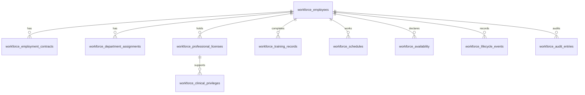

# Module 05 Database Design

## Common columns
Every table includes `id uuid primary key`, `created_at`, `created_by_id`, `updated_at`, `updated_by_id`, `deleted_at`, `deleted_by_id`, `version integer`, `tenant_id`, and `metadata jsonb`. Soft-deleted rows are filtered by default. Version increments enforce optimistic concurrency.

## Tables
| Table | Purpose | Key foreign keys | Constraints and indexes |
|---|---|---|---|
| workforce_employees | Employee master record | identity_user_id, primary_manager_id, primary_department_id, salary_grade_ref, leave_balance_ref | unique employee_number, unique active national_id/passport where present, indexes on status/category/name/department |
| workforce_employment_contracts | Contracts and contract changes | employee_id, legal_entity_id, branch_id | active contract date exclusion per employee, index employee/status |
| workforce_department_assignments | Primary, secondary, temporary, acting, cross-branch assignments | employee_id, organization_unit_id, manager_id, cost_centre_id, revenue_centre_id | one active primary assignment, no invalid date range, indexes employee/unit/type |
| workforce_position_history | Position and reporting history | employee_id, position_id, manager_id | effective date integrity, cyclic manager validation in service |
| workforce_professional_licenses | License and council registrations | employee_id | unique issuing_body/license_number, expiry indexes, verified-before-privilege rule |
| workforce_clinical_privileges | Scope and authorizations | employee_id, license_id, approved_by_id | active privilege requires verified license, expiry index, privilege type index |
| workforce_training_records | Mandatory and optional training | employee_id, course_id | completion/expiry indexes, mandatory compliance index |
| workforce_qualifications | Academic history and qualifications | employee_id | institution/year indexes |
| workforce_certifications | Professional and board certifications | employee_id | unique certification number where present, expiry index |
| workforce_emergency_contacts | Emergency contacts | employee_id | at least one primary contact service rule |
| workforce_dependents | Dependents | employee_id | relationship index |
| workforce_attendance_references | External attendance references | employee_id | source/reference uniqueness |
| workforce_biometrics | Biometric enrollment metadata | employee_id | one active biometric per modality, encrypted template reference |
| workforce_digital_signatures | Signature certificate metadata | employee_id | certificate expiry index |
| workforce_assets_issued | Assets and uniforms issued | employee_id, asset_id | issue/return date integrity |
| workforce_occupational_health | Occupational health status | employee_id | confidential access policy, fitness status index |
| workforce_vaccination_records | Vaccinations and boosters | employee_id | vaccine/due date indexes |
| workforce_background_checks | Identity, criminal, reference checks | employee_id | result/status indexes |
| workforce_performance_reviews | Performance reviews | employee_id, reviewer_id | review due date index |
| workforce_disciplinary_actions | Disciplinary records | employee_id, issued_by_id | severity/status indexes |
| workforce_awards | Awards and recognition | employee_id | award date index |
| workforce_research_profiles | Research interests, publications, studies | employee_id | specialty/research interest GIN indexes |
| workforce_committee_memberships | Committees and task forces | employee_id, committee_id | active membership date index |
| workforce_projects | Project assignments | employee_id, project_id | allocation percent constraints |
| workforce_schedules | Shifts, rosters, sessions, coverage | employee_id, unit_id | overlap exclusion, status/date indexes |
| workforce_availability | Availability, leave, vacation, conferences | employee_id | overlap exclusion, type/date indexes |
| workforce_lifecycle_events | Append-only employment events | employee_id, approved_by_id | event type/date indexes, immutable after approval |
| workforce_audit_entries | Field-level audit history | actor_id, employee_id | correlation id, model/object, timestamp indexes |
| workforce_documents | Versioned document references | employee_id | document type/version unique constraint |

## Entity relationships

